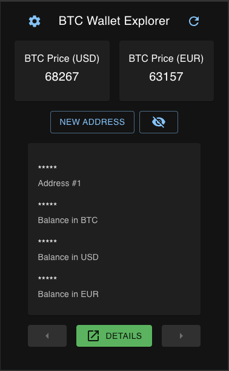

# BTC Wallet Explorer

React app to check investments done in this cryptocurrency.

## Features

- [x] List current Bitcoin prices in USD and EUR.
- [x] Explore Bitcoin addresses by showing balances, listing their most recent transactions or checking stats about them.
- [x] Privacy mode in case you do not want to show your data.

## Sites this app queries

All data is processed client-side, and no request are made apart to the following sites for essential data:

- mempool.space
- blockchain.com

## Screenshots

